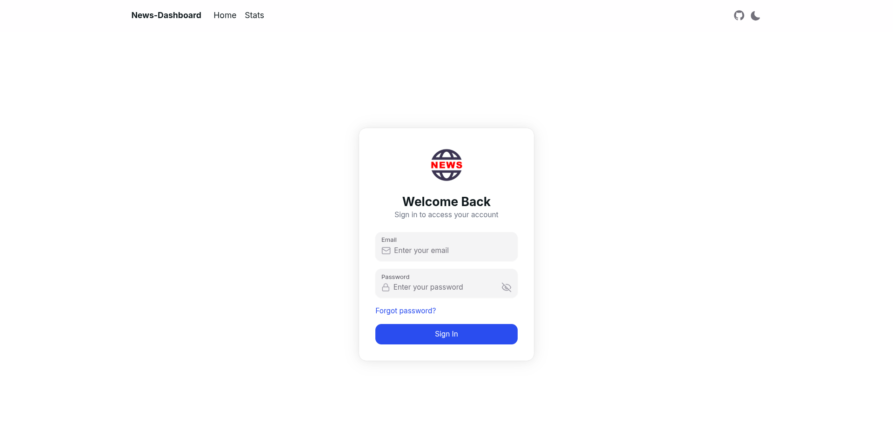
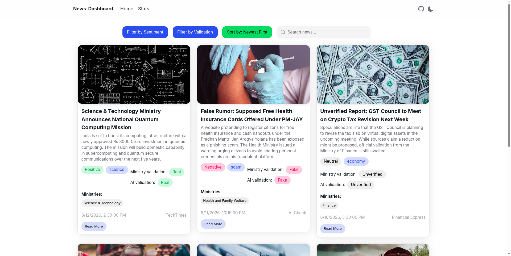
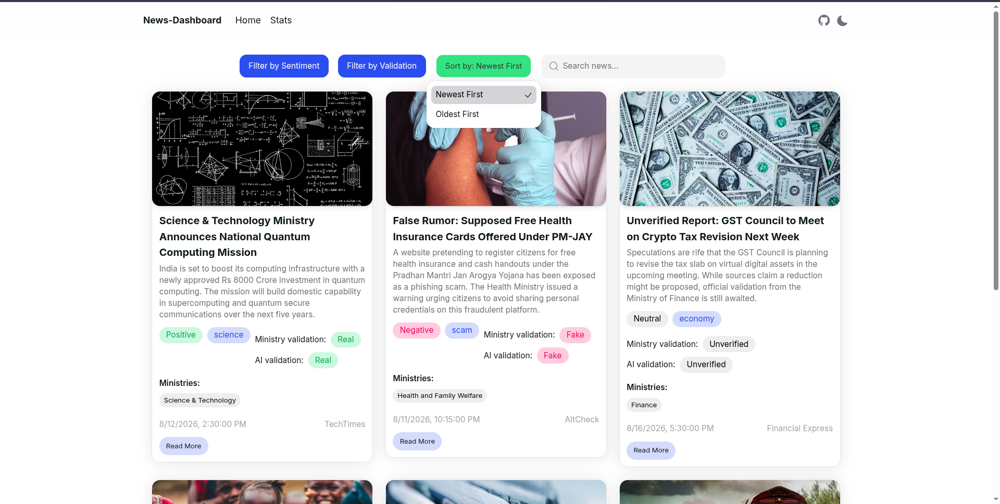
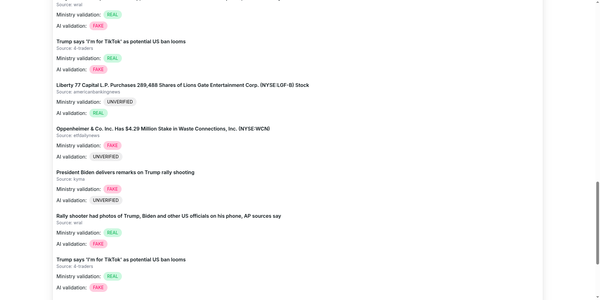
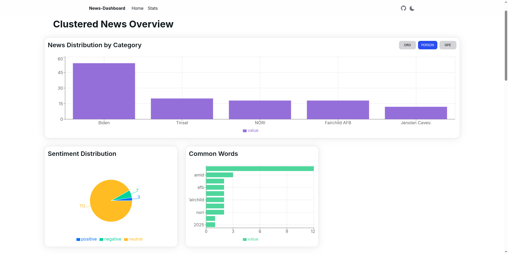
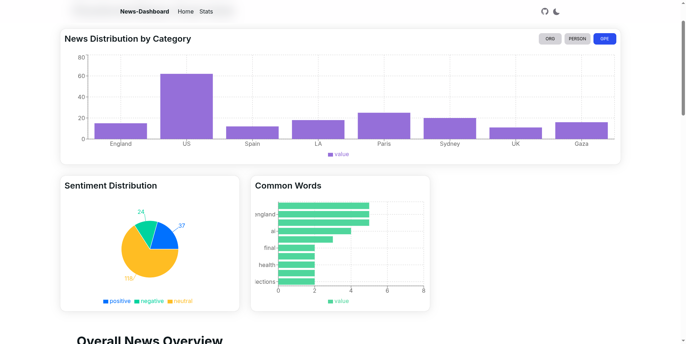

# DemocraticNet 🛡️

DemocraticNet is a powerful platform designed to combat misinformation and protect democratic values in the digital age. By integrating data-driven verification, backend analytics, and an intuitive user interface, DemocraticNet serves as a shield against the proliferation of fake news and disinformation campaigns.

---

## 🏆 DataQuest2024 Hackathon - First Place Winners 🥇

Our team is proud to have secured **FIRST PLACE 🥇** at the **DataQuest2024 Hackathon**!

*   **Organizers & Sponsors:** Organized at the **Adani Institute of Digital Technology Management (AIDTM)** and sponsored by the **MSBC Group**.
*   **Grand Prize:** Secured a prize of **₹70,000**!
*   **Competition:** Competed alongside 120 brilliant minds, all bringing innovative solutions to real-world challenges.
*   **Our Solution:** Developed a real-world, real-time misinformation detection and analytics platform that stood out to the judges.

### Team Members
*   **Neel Shah**
*   **Pankil Soni**
*   **Sneh Shah**
---

## 📖 Table of Contents

- [Introduction](#introduction)
- [What We Made](#what-we-made)
- [Key Features](#key-features)
- [Screenshots & Presentation](#screenshots--presentation)
- [Technologies Used](#technologies-used)
- [Architecture](#architecture)
- [Installation & Setup](#installation--setup)
- [Usage](#usage)
- [Scaling Up Plan](#scaling-up-plan)
- [Security Plan](#security-plan)
- [Contact](#contact)

---

## ℹ️ Introduction

In today's digital landscape, misinformation spreads rapidly across social media and digital portals, threatening the integrity of public discourse and democratic institutions. DemocraticNet addresses this critical challenge by providing a reliable platform that aggregates, analyzes, and categorizes news articles, allowing users and ministries to track and verify information.

---

## 🛠️ What We Made

DemocraticNet is an end-to-end web application that aggregates articles and provides verification analysis.
1.  **News Classification & Verification:** Classifies articles as **REAL**, **FAKE**, or **UNVERIFIED** to alert users of potential misinformation.
2.  **Entity & Category Tracking:** Automatically maps articles to relevant ministries (e.g., Information & Broadcasting, Defence, Finance) and extracts key entities (Organizations, Persons, Locations).
3.  **Sentiment Analysis:** Analyzes the sentiment of articles (Positive, Negative, Neutral) to understand the tone of public discourse.
4.  **Interactive Dashboard:** Provides visualization of top news sources, ministry-wise distribution of articles, and sentiment trends.

---

## 🚀 Key Features

*   **Real-time Misinformation Detection:** Track and review news verification status.
*   **Data Analytics Dashboard:** Visualize key statistics like sentiment distribution and top-reported ministries.
*   **Role-Based access & Seeded Workflows:** Features specific views for different government ministries to monitor relevant news.
*   **Fully-Documented API:** Provides clean JSON endpoints for third-party integration.

---

## 🖼️ Screenshots & Presentation

You can view the project presentation here:
*   [DemocraticNet Hackathon Presentation (PDF)](assets/presentation.pdf)

### Application Screenshots

#### 1. Login Page
The secure entry point for authorized users and ministry personnel.


#### 2. News Dashboard
The main feed showing aggregated articles with real-time sentiment tags, ministry validation tags, and AI verification status.


#### 3. News Sorting & Filtering
Interactive controls allowing users to sort by newest/oldest and filter by specific categories.


#### 4. News Validation Comparison
Detailed side-by-side validation checks showing the official ministry validation versus AI-generated predictions.


#### 5. Clustered News Analytics Overview
A comprehensive dashboard providing stats on news distributions by categories (organizations, persons, locations) and general sentiment analysis.


#### 6. Geopolitical News Analytics
Geographical news distribution analytics displaying trends across different locations (GPE) along with matching sentiment charts.


---

## 💻 Technologies Used

*   **Frontend:** Next.js, React, Vanilla CSS
*   **Backend:** Node.js, Express.js
*   **Database:** MongoDB, Mongoose ODM
*   **Authentication & Security:** JWT (JSON Web Tokens), bcryptjs
*   **Environment & Configuration:** Dotenv

---

## 🏗️ Architecture

The application split follows a classic decoupled client-server architecture:
*   **Frontend (Client):** A responsive Next.js web application that interacts with the backend endpoints to render dynamic news cards, analytical charts, and entity stats.
*   **Backend (Server):** An Express.js REST API handling database queries, content filtering, and data aggregation for analytics.
*   **Database:** MongoDB storing seeded news collections and user credentials.

---

## ⚙️ Installation & Setup

To run a copy of the project locally, follow these steps:

### Prerequisites
*   Node.js (v18 or higher recommended)
*   MongoDB running locally or a MongoDB Atlas URI

### 1. Clone the Repository
```bash
git clone https://github.com/your-username/DemocraticNet-Msbc-Hackathon.git
cd DemocraticNet-Msbc-Hackathon
```

### 2. Backend Setup
```bash
cd backend
# Install dependencies
npm install

# (Optional) Seed the database with mock news articles and users
node seed.js

# Start the Express server
npm start
```

### 3. Frontend Setup
```bash
cd ../frontend
# Install dependencies
npm install

# Run the development server
npm run dev
```

---

## 📊 Usage

1. Open the application in your browser.
2. View the homepage to see the latest articles, their validation status, and ministry assignments.
3. Access the dashboard/about page to view interactive analysis charts, including sentiment trends and top ministries.

---

## 📈 Scaling Up Plan

*   **Cloud Deployment:** Containerize using Docker and deploy to Kubernetes or AWS/GCP with auto-scaling configured.
*   **Caching Layer:** Integrate Redis to cache database queries for common analytics.
*   **Message Queues:** Implement Apache Kafka or RabbitMQ for handling large-scale real-time article ingestion streams.
*   **Advanced AI Integration:** Plug in LLM-based verification agents to perform automated deep fact-checking.

---

## 🔒 Security Plan

*   **Secure Authentication:** Implement robust JWT authentication with HTTP-only cookies.
*   **Data Encryption:** Use SSL/TLS for encrypting data in transit, and encrypt sensitive data at rest.
*   **Input Validation:** Use Express-validator or Joi to validate inputs and prevent injection or XSS attacks.
*   **Rate Limiting:** Protect public APIs against DDoS and scraping attacks.

---

## 📧 Contact

*   **Neel Shah:** neeldevenshah@gmail.com
*   **Pankil Soni:** pmsoni2016@gmail.com
*   **Sneh Shah:** snehs5483@gmail.com
